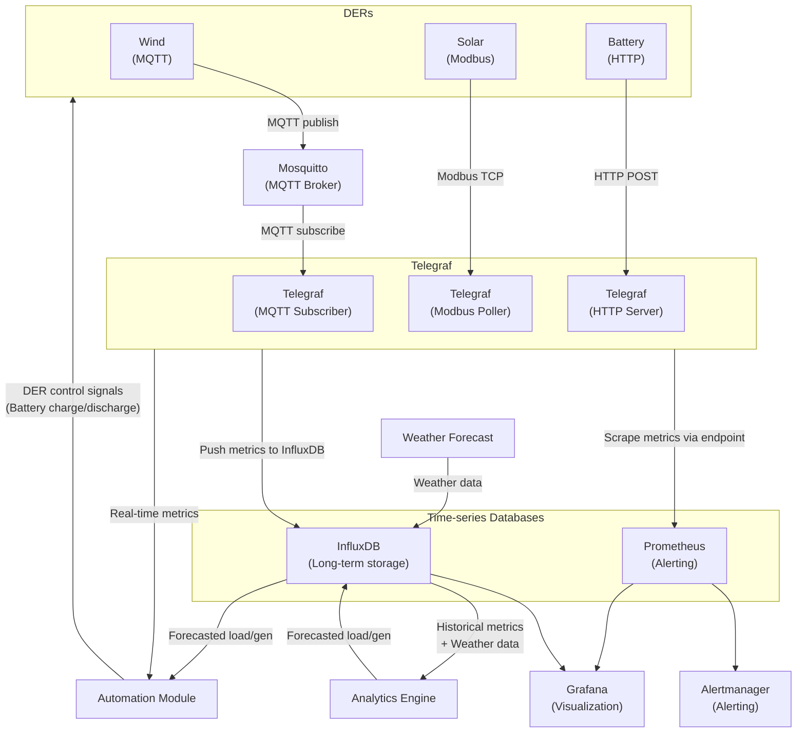

# Microgrid Data Analytics, Monitoring, and Automation for Remote Communities

### Data flow
1. DERs generate and send telemetry via some communication protocol
    - Some common protocols: Modbus, DNP3, IEC61850, MQTT, HTTP
2. Telegraf ingests and processes all telemetry data and:
    - Pushes data to InfluxDB
    - Exposes data for Prometheus to scrape from
3. Prometheus scrapes metrics and, if needed, triggers alerts via Alertmanager
    - Can send alerts via Email, SMS, Discord, Slack, and more
4. Analytics engine retrieves historical data + weather and forecasts future load and generation
    - Forecasted metrics are pushed back into InfluxDB
6. Automation module retrieves real-time and forecasted metrics and sends control signals to DERs
    - Main control is whether to charge or discharge the battery
7. Grafana dashboards provide visualization of telemetry, forecasts, automation actions, and alerts

### System architecture diagram

